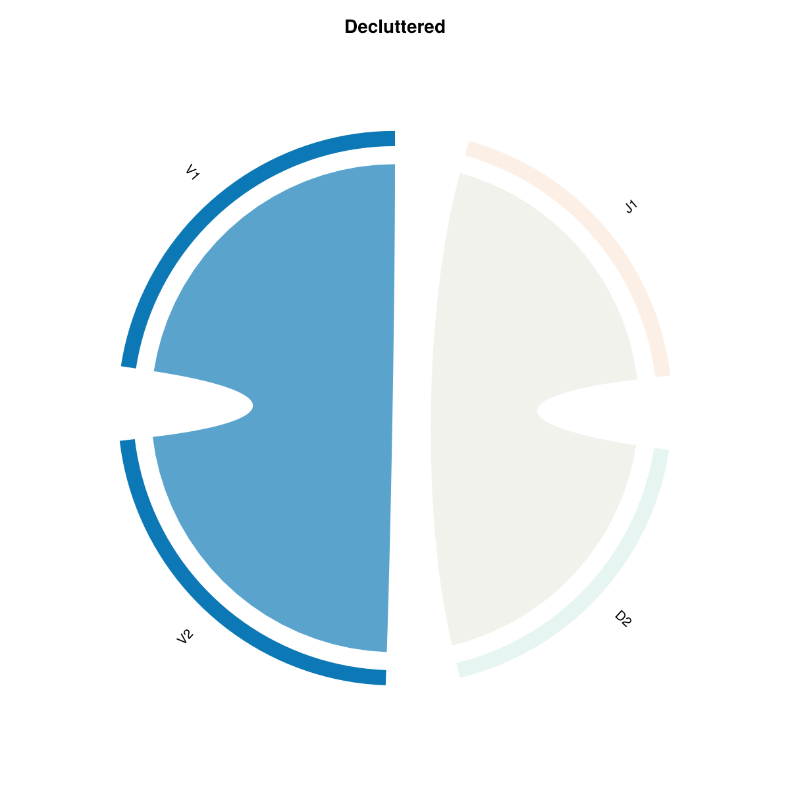
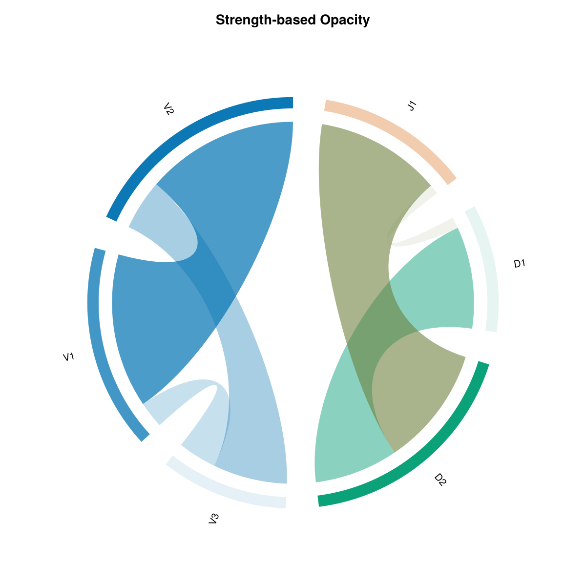
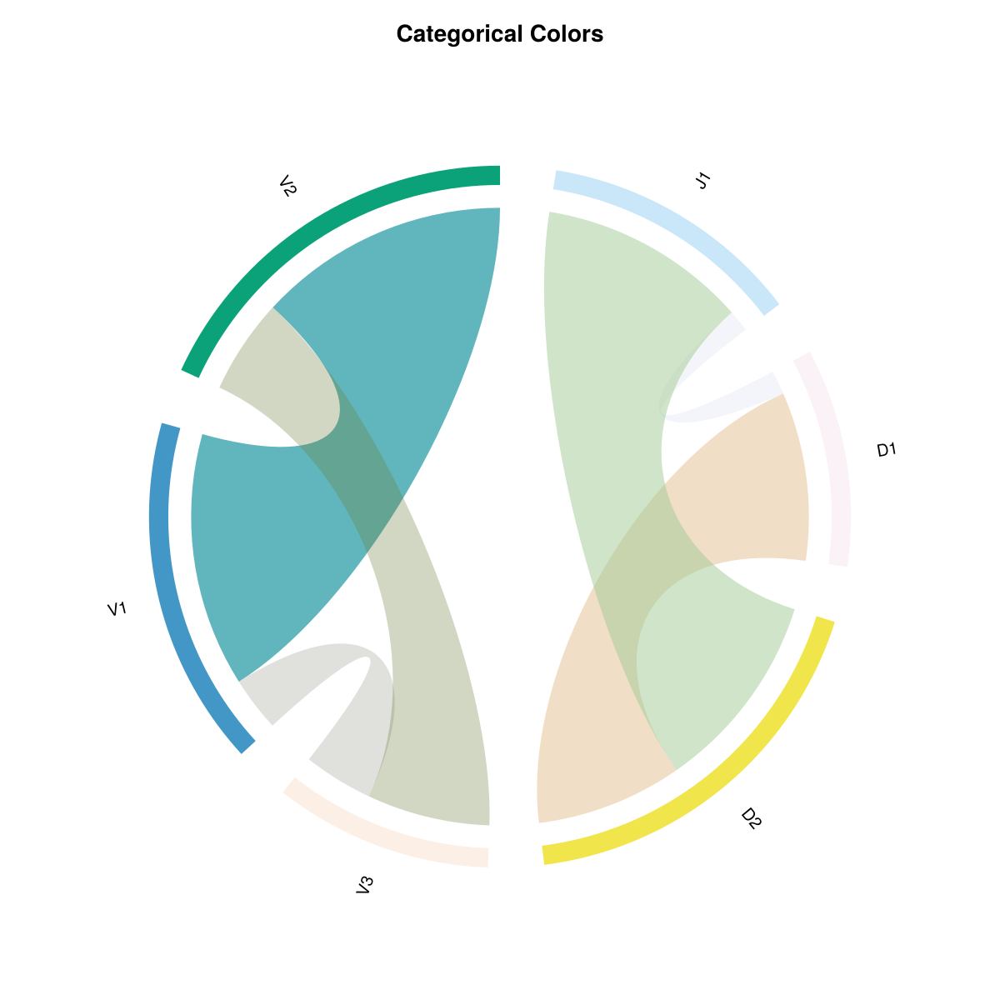
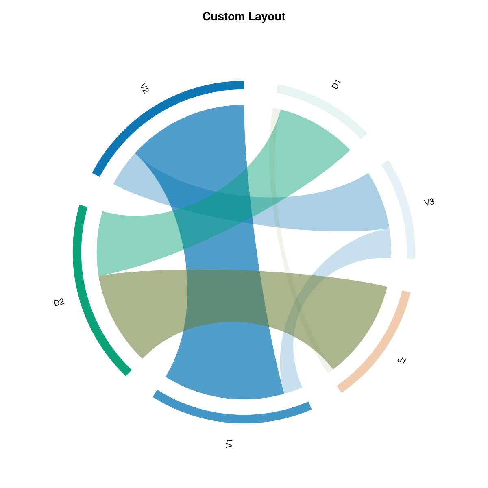

# Gallery

Figures are generated by [`docs/generate_examples.jl`](https://github.com/mashu/ChordPlots.jl/blob/main/docs/generate_examples.jl) when you build the docs (`docs/make.jl` runs it). Shared style: `theme_light()` + [`chord_theme`](@ref), with semi-transparent ribbons via [`ComponentAlpha`](@ref) (same idea as [`chordplot`](@ref) defaults).

## Basic chord diagram

Toy V/D/J matrix, `colorscheme = :group`. **[Basic Example](basic.md)**

## Filtered

Higher `min_arc_flow` / `min_ribbon_value`. **[Filtering](../user_guide/filtering.md)**

## Strength-based opacity

[`ValueScaling`](@ref) on ribbons and arcs. **[Customization](../user_guide/customization.md)**

## Categorical colors

`colorscheme = :categorical`. **[Color Schemes](../user_guide/colors.md)**

## Layout by value

`sort_by = :value` and tighter geometry (see `generate_examples.jl`). **[Layout](../user_guide/layout.md)**

## Ribbon envelope

Mean ± band matrices. **[Ribbon envelope](ribbon_envelope.md)**

## Stacked per-donor layers

[`CoOccurrenceLayers`](@ref). **[Multiple layers](cooccurrence_layers.md)**
