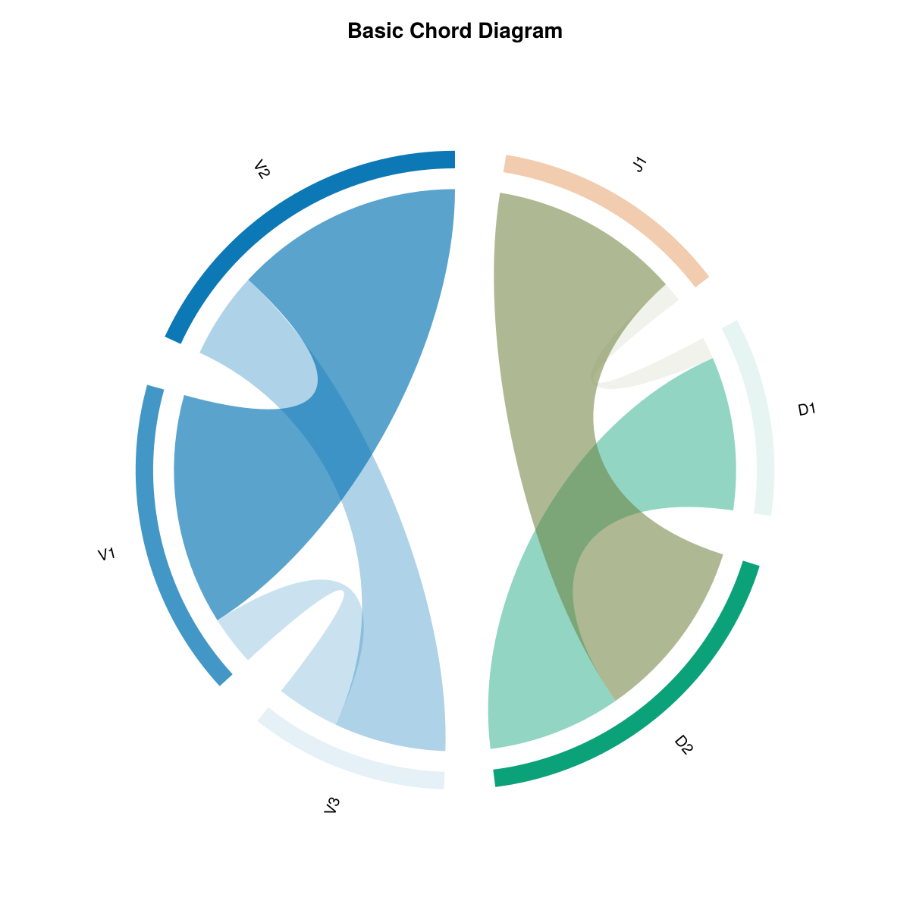

# Getting Started

This guide will help you create your first chord diagram with ChordPlots.jl.

## Installation

```julia
using Pkg
Pkg.add(url="https://github.com/mashu/ChordPlots.jl")
```

## Your First Chord Diagram

```julia
using CairoMakie, ChordPlots

# Provide a preprocessed weight matrix (counts, frequencies, scores, etc.)
matrix = [0 3 1;
          3 0 2;
          1 2 0]

# `groups_from` builds the flat label vector and the per-group index ranges.
# (For the explicit form, see "Creating Data".)
labels, groups = groups_from((:G => ["A", "B", "C"]))
cooc = CoOccurrenceMatrix(matrix, labels, groups)

# A reusable theme removes the per-figure boilerplate (background, fonts, no spines).
set_theme!(chord_theme())

fig = Figure(size = (800, 800))
ax = Axis(fig[1, 1], title = "My First Chord Diagram")
chordplot!(ax, cooc)
setup_chord_axis!(ax)
fig
```

```@raw html

```

**What you see:** This basic chord diagram shows the default visualization. Labels (V1, V2, V3, D1, D2, J1, J2) are arranged around the circle, grouped by their category. The colored arcs represent each label, and the curved ribbons connect labels that appear together in the data. Ribbon thickness indicates how frequently labels co-occur. Colors are assigned by group (all V labels share one color, all D labels another, etc.), using the default Wong color palette for a professional, colorblind-friendly appearance.

## What Happens Here?

1. **Data Preparation**: Prepare any weight matrix that represents relationships between labels
2. **Weights**: compute counts/frequencies/scores externally (ChordPlots does not prescribe normalization)
3. **Plotting**: `chordplot!` creates the visual representation
4. **Setup**: `setup_chord_axis!` configures the axis for optimal display

## Next Steps

- Learn about [creating co-occurrence data](user_guide/creating_data.md)
- Explore [customization options](user_guide/customization.md)
- See [example visualizations](examples/basic.md)
