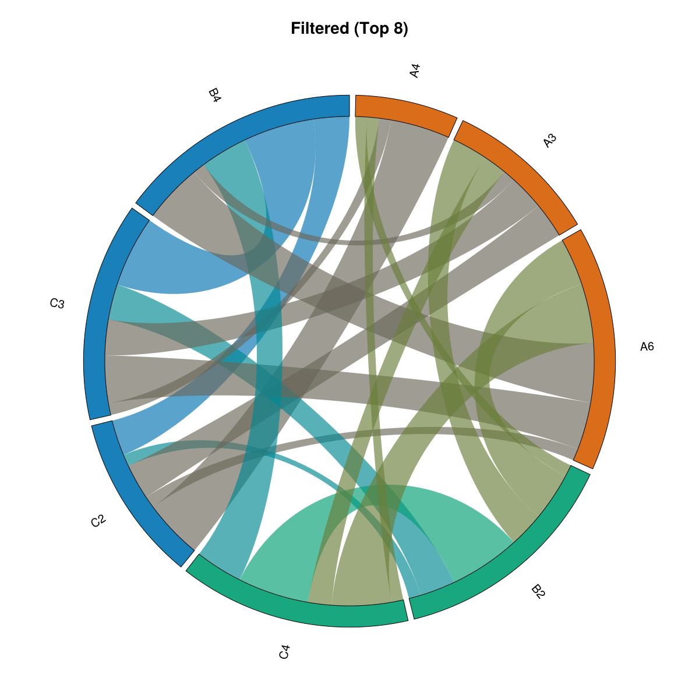
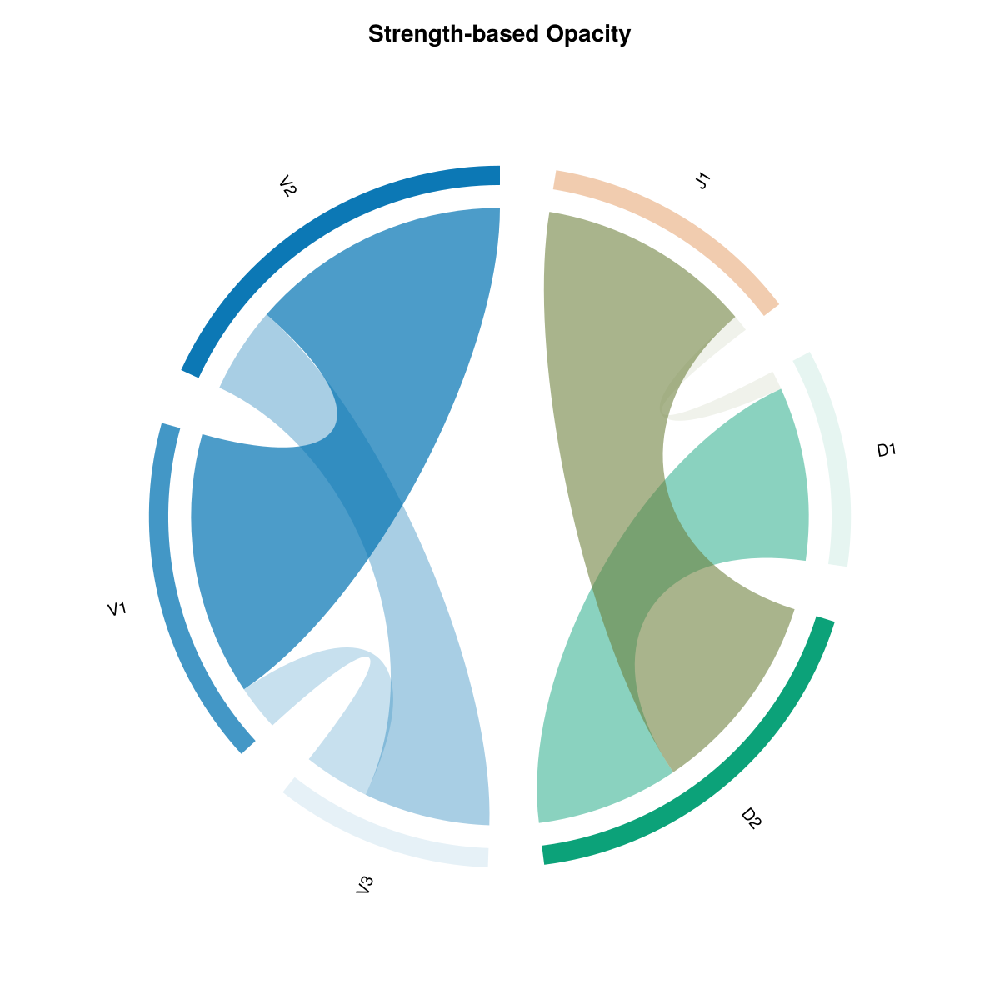
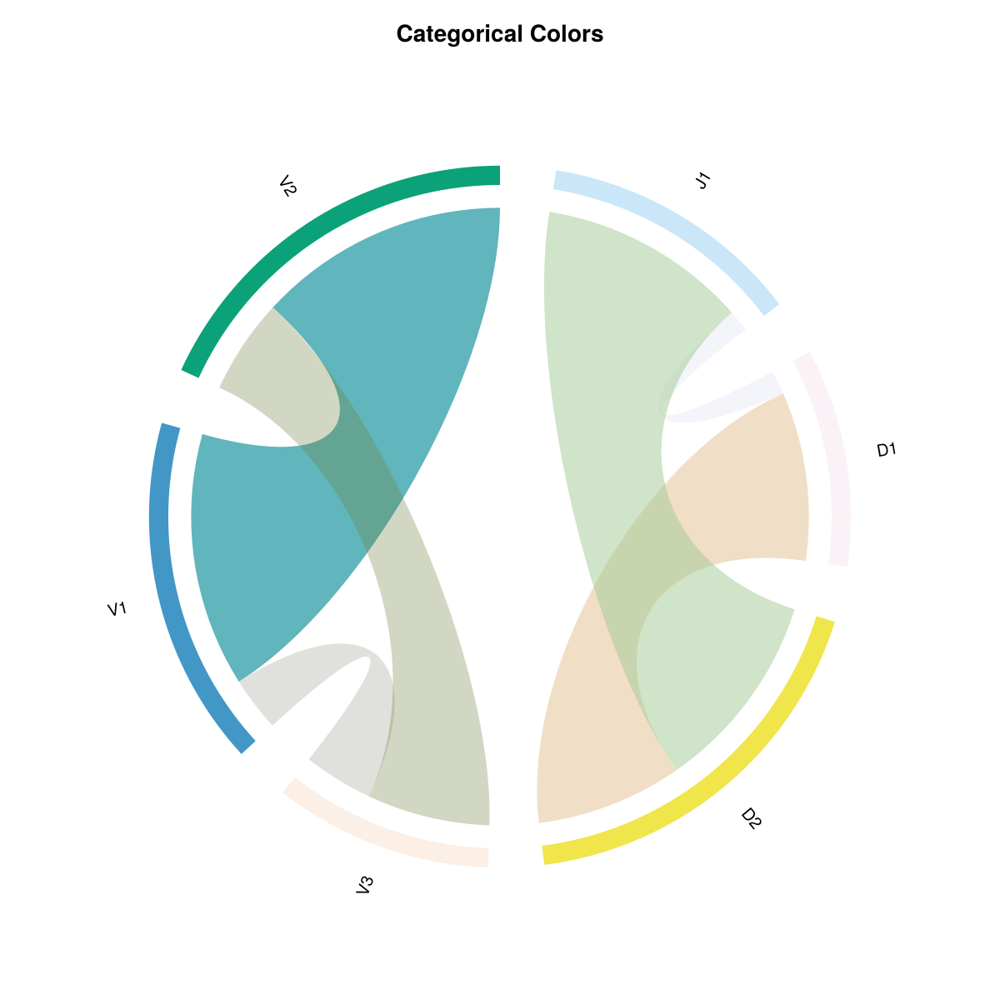
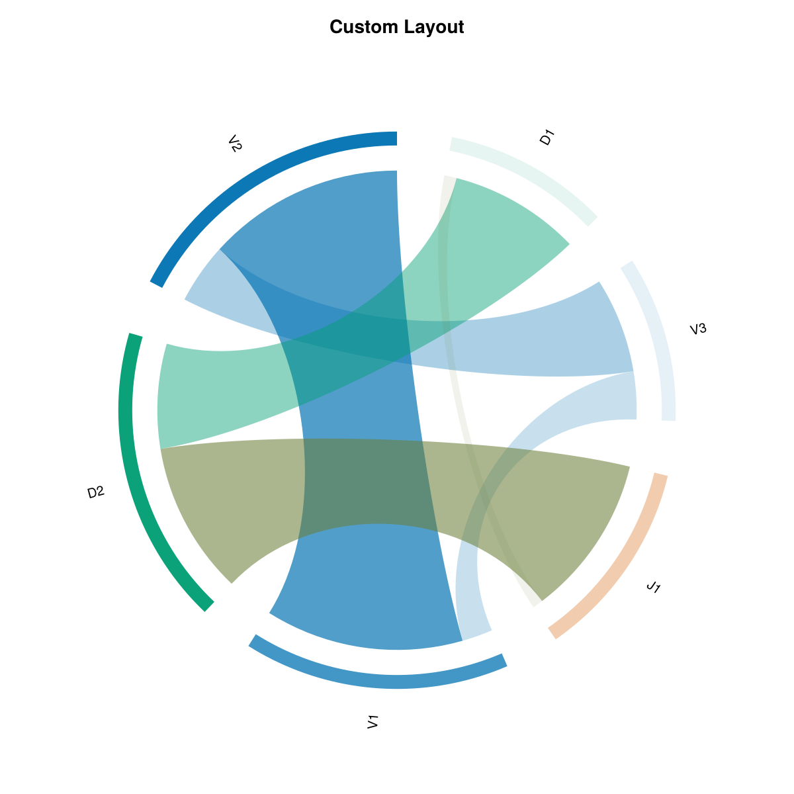

# ChordPlots.jl

```@raw html
<div align="center">
  
  <h1>ChordPlots.jl</h1>
  <p>A Julia package for creating beautiful chord diagrams with Makie</p>
</div>
```

ChordPlots.jl is a Julia package for creating chord diagrams using the Makie plotting ecosystem. Chord diagrams visualize relationships between categorical variables, showing how different categories co-occur with each other.

Chord plots accept two kinds of input data: **co-occurrence counts** (`CoOccurrenceMatrix`, e.g. from `cooccurrence_matrix(df, cols)`) or **normalized/frequency data** (`NormalizedCoOccurrenceMatrix`), e.g. when combining multiple donors by normalizing each matrix by its own total sum and taking the element-wise mean (`mean_normalized`). Both types work with `chordplot` and the rest of the API.

## Features

- **Simple API** - Create chord diagrams from DataFrames
- **Modern colors** - Professional color schemes (Wong palette, same as AlgebraOfGraphics)
- **Flexible filtering** - Filter by value, top N, or minimum flow
- **Customizable** - Control layout, colors, labels, and styling
- **Type-stable** - Efficient parametric types for performance

## Quick Start

```julia
using CairoMakie, ChordPlots, DataFrames

df = DataFrame(
    V = ["V1", "V1", "V2", "V2"],
    D = ["D1", "D2", "D1", "D2"],
    J = ["J1", "J1", "J2", "J2"]
)

cooc = cooccurrence_matrix(df, [:V, :D, :J])

fig = Figure(size=(800, 800))
ax = Axis(fig[1,1])
chordplot!(ax, cooc)
setup_chord_axis!(ax)
fig
```

## Example Visualizations

### Basic Chord Diagram

This is the default chord diagram with standard settings. Labels are arranged around the circle grouped by their category (V, D, J), and ribbons connect labels that co-occur. Ribbon thickness represents the co-occurrence frequency. Colors are assigned by group (each category gets a distinct color), and all ribbons use uniform opacity.

**Key features:**
- Default group-based color scheme (Wong palette)
- Fully opaque by default (`alpha = 1.0`)
- Labels sorted by group
- Standard inner radius (`inner_radius = 0.92`)


### Filtered Data

This example demonstrates data filtering using `filter_top_n()`, which keeps only the top 8 labels by total flow (sum of all connections). The original dataset contained many more labels (A1-A8, B1-B5, C1-C4), but filtering reduces it to only the most connected labels. This is particularly useful when working with large datasets where you want to focus on the most important relationships and reduce visual clutter from many small, weaker connections.

**What this shows:**
- Only top 8 labels by total flow are displayed (out of many more in the original data)
- Focuses attention on the strongest relationships
- Useful for large datasets where filtering helps identify key patterns



### Strength-based Opacity

With **`alpha_by_value=true`**, opacity is scaled by strength for ribbons, arcs, and labels: ribbons by co-occurrence value, arcs and labels by total flow. Weaker connections and nodes become dimmer; one switch for consistent styling.

**What's different:**
- `alpha_by_value=true` scales opacity by strength everywhere
- Ribbons: higher co-occurrence value → more opaque
- Arcs and labels: higher total flow → more opaque
- Minimum opacity 10% so nothing disappears



### Categorical Colors

This example uses `colorscheme=:categorical`, which assigns a distinct color to each individual label rather than grouping by category. Every label gets its own unique color from the palette, making it easier to distinguish individual labels at the cost of losing the group-based color coding.

**What's different:**
- `colorscheme=:categorical` instead of `:group`
- Each label has its own distinct color
- No color grouping by category
- Useful when you need to distinguish many individual labels



### Custom Layout

**What is a custom layout?** A custom layout allows you to control how labels are arranged around the circle and how the arcs are sized. This example demonstrates several layout customizations: sorting by value (largest arcs first), adjusting the inner radius (how close ribbons start to the center), and changing the gap between arcs.

**What's different:**
- `sort_by=:value` - Labels are sorted by their total flow (largest first), so the most connected labels get the largest arcs
- `inner_radius=0.85` - Ribbons start closer to the center (default is 0.92), creating more space between ribbon endpoints and the outer circle
- `gap_fraction=0.05` - Slightly larger gaps between arc segments (default is 0.03), making individual arcs more distinct

These settings help emphasize the most important labels and create a different visual balance compared to the default group-sorted layout.



## Installation

```julia
using Pkg
Pkg.add(url="https://github.com/mashu/ChordPlots.jl")
```

## Documentation

Explore the documentation to learn how to:
- [Get started](getting_started.md) with your first chord diagram
- [Create co-occurrence data](user_guide/creating_data.md) from various sources
- [Customize appearance](user_guide/customization.md) with colors, layouts, and styling
- [Filter and manage data](user_guide/filtering.md) for better visualizations
- [Use advanced features](user_guide/layout.md) for publication-quality figures

## License

MIT License
